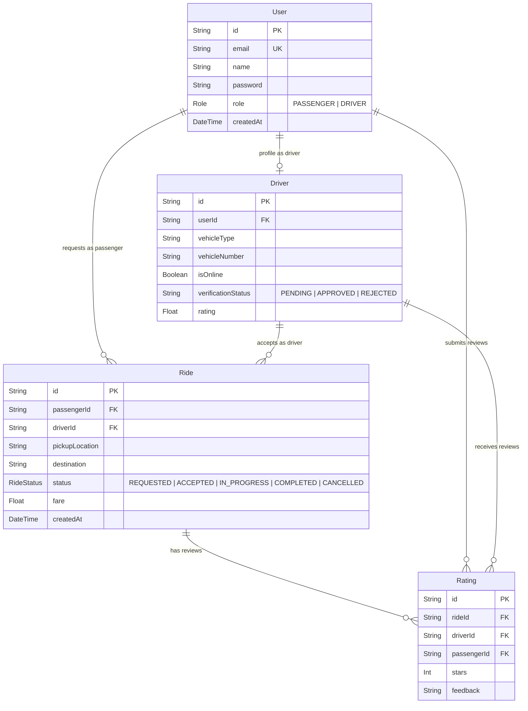

# Database Schema Documentation

This document describes the database design for the Rydo Campus Mobility Platform. The database runs on **Neon PostgreSQL** and is managed via **Prisma ORM**.

---

## ERD Overview & Relationships

---

## Detailed Model Definitions

### 1. User Model
Represents any account registered on the platform. Can be either a Passenger or a Driver.

| Field | Type | Attributes | Description |
|---|---|---|---|
| `id` | `String` | `@id`, `@default(uuid())` | Primary key |
| `email` | `String` | `@unique` | Login email identifier |
| `name` | `String?` | Optional | User's full name |
| `password` | `String` | - | Hashed password string |
| `role` | `Role` | `Enum (PASSENGER, DRIVER)` | Designates user profile privileges |
| `createdAt` | `DateTime` | `@default(now())` | Creation timestamp |

### 2. Driver Model
Extends the `User` model with driver-specific properties.

| Field | Type | Attributes | Description |
|---|---|---|---|
| `id` | `String` | `@id`, `@default(uuid())` | Primary key |
| `userId` | `String` | `@unique`, FK | Relation to `User.id` |
| `vehicleType` | `String` | - | E.g., "E-Rickshaw" |
| `vehicleNumber` | `String` | - | License plate number |
| `isOnline` | `Boolean` | `@default(false)` | Flag showing if driver is accepting requests |
| `verificationStatus` | `String` | - | Verification workflow state |
| `rating` | `Float` | `@default(5.0)` | Running average rating |

### 3. Ride Model
Represents the state and workflow tracking of a single ride booking.

| Field | Type | Attributes | Description |
|---|---|---|---|
| `id` | `String` | `@id`, `@default(uuid())` | Primary key |
| `passengerId` | `String` | FK | Relation to `User.id` (Passenger) |
| `driverId` | `String?` | FK, Optional | Relation to `Driver.id` (assigned Driver) |
| `pickupLocation` | `String` | - | Pickup coordinates or landmark |
| `destination` | `String` | - | Destination coordinates or landmark |
| `status` | `RideStatus` | `Enum`, `@default(REQUESTED)` | Workflow state |
| `fare` | `Float` | - | Estimated/calculated fare |
| `createdAt` | `DateTime` | `@default(now())` | Request timestamp |

### 4. Rating Model
Stores reviews submitted by passengers for completed rides.

| Field | Type | Attributes | Description |
|---|---|---|---|
| `id` | `String` | `@id`, `@default(uuid())` | Primary key |
| `rideId` | `String` | `@unique`, FK | Relation to `Ride.id` |
| `driverId` | `String` | FK | Relation to `Driver.id` |
| `passengerId` | `String` | FK | Relation to `User.id` (Passenger) |
| `stars` | `Int` | - | Numeric rating (1 - 5) |
| `feedback` | `String?` | Optional | Written feedback text |

---

## Design Choices & Integrity Constraints

1. **Transactional Assignments**: When a driver accepts a ride request, the database update must be wrapped in a transaction checking that `driverId` is `null` and status is `REQUESTED`. This guarantees that a ride can never be double-assigned.
2. **Cascading Behavior**: Deleting a User accounts should cascade delete their corresponding Driver profile, but preserve Ride history (by set null or default) to maintain business analytics integrity.
3. **Indexing**: Indexes will be established on:
   - `User.email` (Implicit via `@unique`)
   - `Driver.userId` (Implicit via `@unique`)
   - `Driver.isOnline` for fast query of available drivers by passengers
   - `Ride.passengerId` and `Ride.driverId` to optimize history lookup queries
